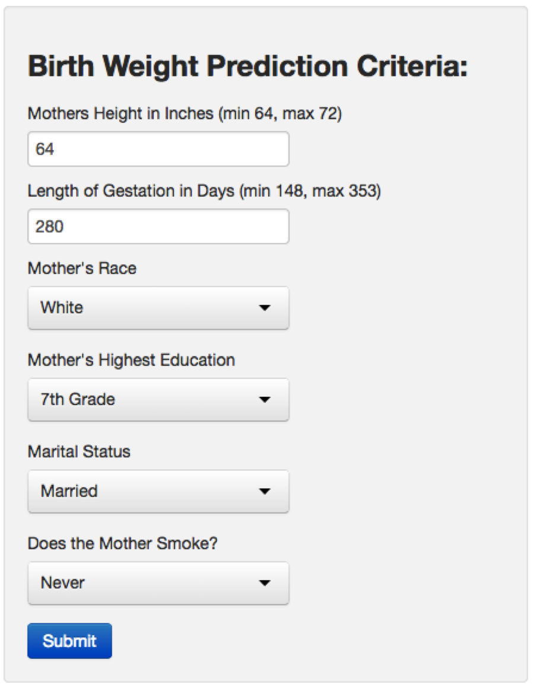
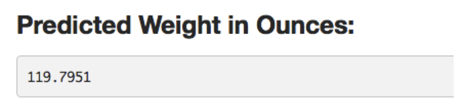

## Birth Weight and Health

1. Birth weight can be an important indicator of child health
2. Several factors can contribute to a child's birth weight
3. Wouldn't it be nice if you had a great model with an easy front end to help you understand the contributing factors and let you see how they impact predicted birth weight?

---

## Super Birth Weight Predictor 1000

Using the babies dataset from the UsingR package we have created just the model and interface you've been looking for!

After countless hours of research we have developed this advanced model for predicting birth weight.
We have identified 6 important factors that impact birth weight: 
- Mother's Height
- Gestation Period
- Mother's Race
- Mother's Education
- Marital Status
- If the Mother Smokes

--- 

## New model
Using these we have built the following model: 

```r
library(UsingR)
data(babies)
fit <- lm(wt ~ ht + gestation + race + ed + marital + smoke, babies)
summary(fit)$coef
```

```
##             Estimate Std. Error t value  Pr(>|t|)
## (Intercept) 93.22155   6.814508 13.6799 9.319e-40
## ht           0.39027   0.097999  3.9824 7.223e-05
## gestation    0.01262   0.006832  1.8466 6.504e-02
## race        -0.42747   0.123328 -3.4662 5.462e-04
## ed           0.31397   0.349735  0.8977 3.695e-01
## marital     -1.93629   1.575036 -1.2294 2.192e-01
## smoke       -0.04596   0.441344 -0.1041 9.171e-01
```

Wouldn't it be nicer if there were a web based front end that would let you tinker with different scenarios to see how the model reacts without needing a stats background?

--- 

## Super Birth Weight Predictor 1000 - Web Interface
Now you can create your own scenarios without having to understand the model background!
You fill out the criteria: 
<div style='text-align: center;'>
    
</div>
The application gives you an answer!
<div style='text-align: center;'>
    
</div>
https://eldonjenkins.shinyapps.io/DevelopingDataProducts/
